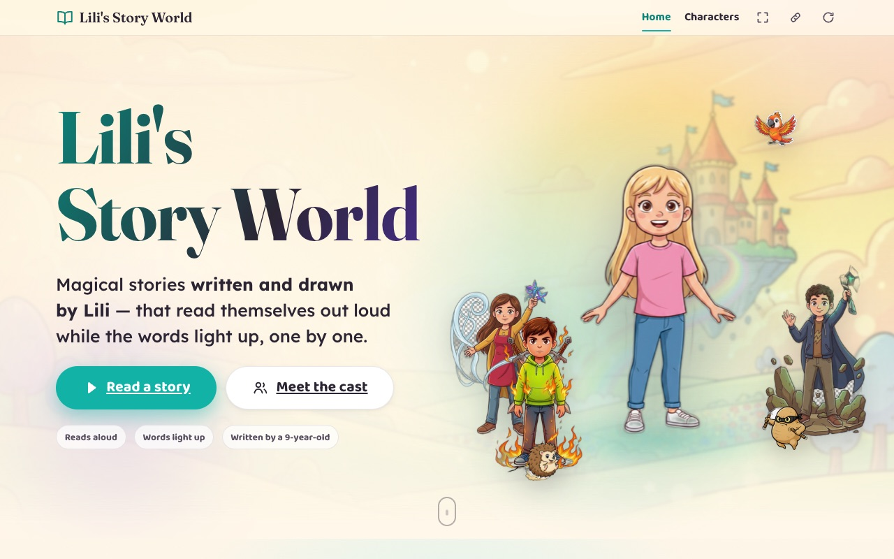
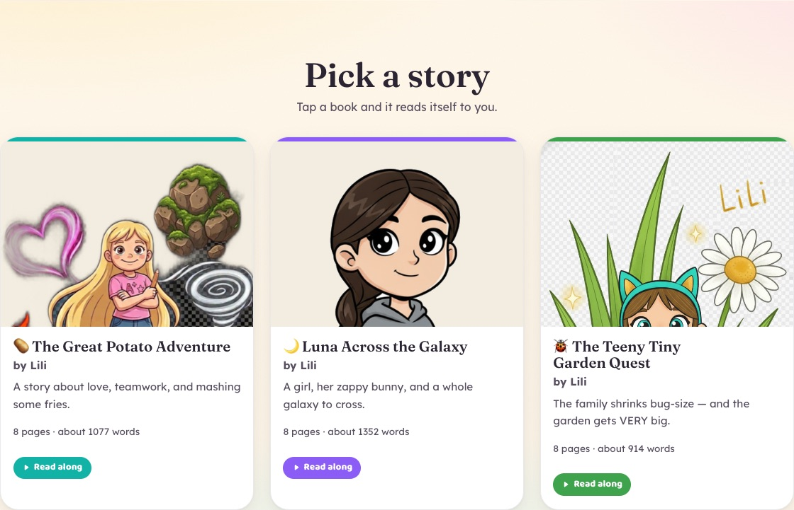
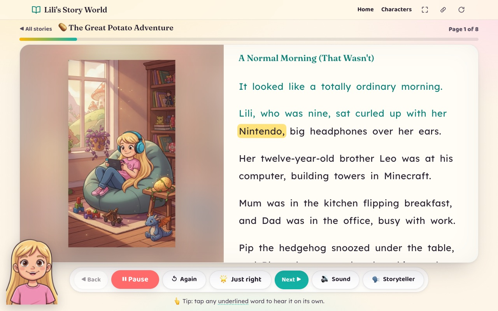
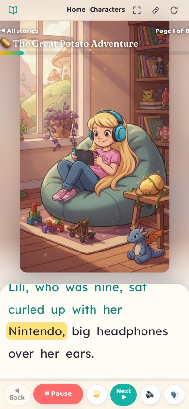
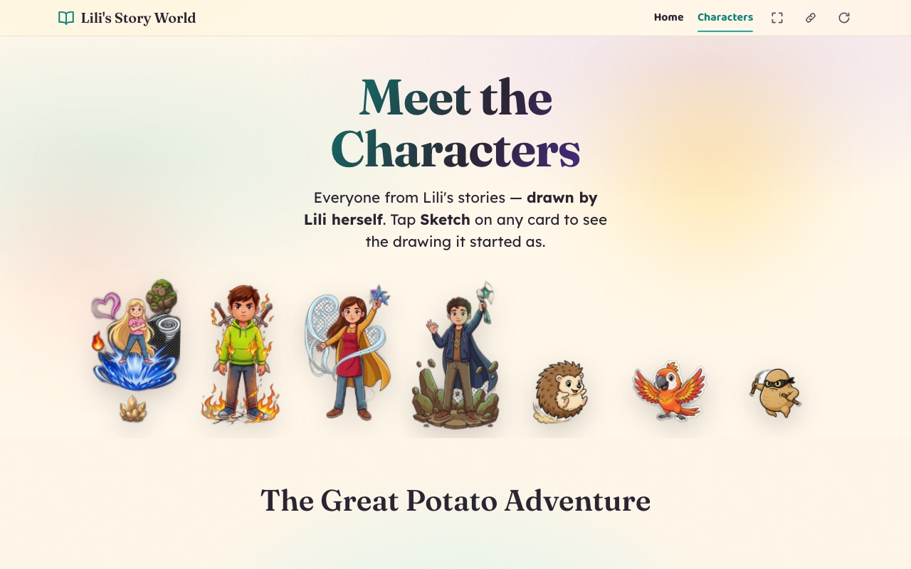

# Lili's Story World

An illustrated read-along storybook website for Lili, a young author who is dyslexic. Each page reads itself aloud while the words light up one by one, with a picture for every paragraph, character voices, music and sound effects.

**Read it here: [victorsaly.github.io/LilianaBlog](https://victorsaly.github.io/LilianaBlog/)**



## Stories

Three stories, all written by Lili, each eight pages long:

| Story | What it's about |
|---|---|
| **The Great Potato Adventure** | A story about love, teamwork, and mashing some fries. |
| **Luna Across the Galaxy** | A girl, her zappy bunny, and a whole galaxy to cross. |
| **The Teeny Tiny Garden Quest** | The family shrinks bug-size, and the garden gets very big. |



## What the reader does

<p>
  
  
</p>

- **Read aloud with word highlighting.** The word being spoken is highlighted; words already read change colour.
- **Tap any word** to hear just that word.
- **A picture for every paragraph.** The illustration changes to match the paragraph being read.
- **Character voices.** The narrator and each character speak in their own pre-recorded UK voice. Speaker portraits appear next to dialogue so it's clear who is talking.
- **Music and sound effects.** A gentle music bed per scene and small sound cues at key moments, kept quiet under the narrator, with an on/off button.
- **Storyteller.** An animated drawing of Lili in the corner whose mouth moves with the narration (can be turned off).
- **Reading speed.** Slow, just right, or fast.
- **Dyslexia-friendly layout.** Warm off-white pages, a clear reading font, generous letter, word and line spacing, short left-aligned lines and large buttons.
- **Works on phones and offline.** On a phone the picture fills the screen behind the text. The site is an installable app that caches stories for offline reading.
- **Fallbacks.** If the recorded audio is missing it uses the browser's own voice; if there is no voice at all, the story can still be read and paged through.

### Meet the characters

The Characters page shows the cast of each story, drawn by Lili. A Sketch button on each card shows the original pencil drawing it started as.



## How it works

- Every story is a Markdown file in `src/stories/`. Each `## Scene` heading is one page, `> Draw this: ...` lines are notes for the illustration, and everything else is read aloud.
- Assets are generated once by scripts and committed as static files, so the live site needs no API keys or server:
  - Scene and character illustrations: Google Gemini (`npm run illustrate`)
  - Narration and per-word timings: Azure Speech (`npm run voices`), voices set in `voices.config.mjs`
  - Music and sound effects: ElevenLabs (`npm run sfx`)
- The reader (`src/components/Reader.astro`) plays the narration and uses the word timings to highlight text in sync. Sound levels go through the Web Audio API so they are correct on iPhone.
- A push to `main` builds and deploys to GitHub Pages via `.github/workflows/deploy.yml`.

## Tech stack

Astro 5, plain TypeScript/JavaScript, Web Audio and Web Speech APIs, a service worker for offline use, GitHub Pages.

## Run locally

```bash
npm install
npm run dev        # http://localhost:4321
npm run build      # build to dist/
npm run preview    # preview the built site
```

### Writing and generating content

| Command | What it does |
|---|---|
| `npm run new-story -- --title "..." --emoji "🐉"` | Scaffold a new story file |
| `npm run illustrate -- --scenes <slug> --per-paragraph` | One illustration per paragraph |
| `npm run illustrate -- <id>` | A single character illustration |
| `npm run storyteller` | Generate the storyteller figure |
| `npm run optimize` | Shrink new art for the web |
| `npm run voices` | Generate narration and word timings (`voices:dry` to preview) |
| `npm run sfx` | Generate music and sound effects |
| `npm run share-card` | Render the social share image |
| `npm run remove-bg` | Cut out an image background (Python, rembg) |

The generation scripts read keys from a git-ignored `.env`: `GEMINI_API_KEY`, `AZURE_SPEECH_KEY`, `AZURE_SPEECH_REGION`, `ELEVENLABS_API_KEY`. None are needed to run or build the site.

The repo also includes two Claude Code skills in `.claude/skills/`: `/new-story` (draft a story from an idea) and `/sketch-to-illustration` (turn one of Lili's sketches into finished art).

More detail: [VOICES-GUIDE.md](VOICES-GUIDE.md), [ILLUSTRATION-GUIDE.md](ILLUSTRATION-GUIDE.md), [DESIGN-SYSTEM.md](DESIGN-SYSTEM.md), [character-bible.md](character-bible.md).

## Project structure

```
src/
  stories/          stories (Markdown), one file per book
  components/       Reader.astro, the read-along engine
  data/             the cast for the Characters page
  layouts/, pages/  page shell, home, characters, story route
  lib/              Markdown parsing and the shared word tokenizer
  styles/           design tokens and reading styles
public/
  art/              illustrations, scene pictures, Lili's sketches
  audio/            narration, word timings, music and sound effects
  fonts/, icons/    bundled fonts and app icons
scripts/            asset generation and story scaffolding
```

## License

The code is MIT licensed, see [LICENSE](LICENSE). The stories and artwork are Lili's own creative work and are not covered by the MIT license; please don't republish them.

Made by [Victor Saly](https://victorsaly.com).
